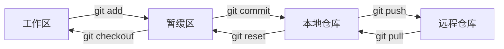

 

```mermaid
graph LR
A[工作区] -->|git add| B[暂缓区]

		B -->|git checkout| A

    B -->|git commit| C[本地仓库]
    
    C -->|git reset| B
    
    C -->|git push| D[远程仓库]
    
    D -->|git pull| C
    
    
    
   

```

